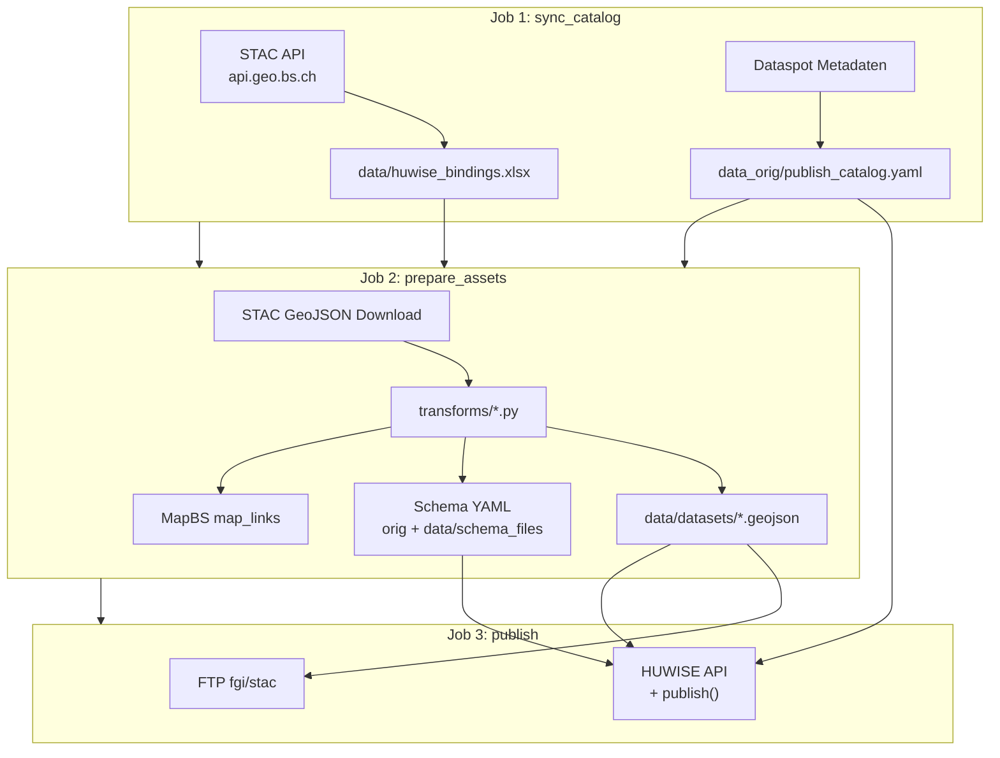

# fgi_stac

Pipeline: STAC/Dataspot → Katalog/Schema/GeoJSON → HUWISE (FTP).

## Neuen Datensatz veröffentlichen

**Voraussetzung:** HUWISE-ID vorhanden und Exchange-Ordner geöffnet (`Exchange-Ordner/StatA/FGI/STAC`).

1. **STAC-Datensatz wählen** — Im Excel `data/huwise_bindings.xlsx` (Exchange-Ordner) und/oder im [STAC Browser (api.geo.bs.ch)](https://radiantearth.github.io/stac-browser/#/external/api.geo.bs.ch/stac/v1/?.language=de) einen passenden Datensatz finden.
2. **HUWISE-ID eintragen** — Im Excel die `huwise_id` in die Zeile des STAC-Eintrags eintragen. Danach den nächsten automatischen Lauf abwarten (Airflow: **51 Minuten nach jeder vollen Stunde**) oder `fgi_stac` in Airflow manuell starten.
3. **Metadaten anpassen** — Datensatz-Metadaten (Titel, Beschreibung, Lizenz usw.) bei Bedarf im **HUWISE-Datenportal** am Datensatz pflegen (nicht im Excel).
4. **Schema anpassen** — Feld-Schema bei Bedarf in `data/schema_files/*.yaml` im Exchange-Ordner anpassen (nicht im Portal; siehe Abschnitt Feld-Schema).

## Ablauf

## Befehle

| Zweck                             | Befehl                                                                                 |
| --------------------------------- | -------------------------------------------------------------------------------------- |
| Nur Katalog + Excel               | `uv run sync_catalog.py`                                                               |
| GeoJSON + Schema + Map-Links      | `uv run prepare_assets.py`                                                             |
| FTP + HUWISE                      | `uv run publish.py`                                                                    |
| Ein Datensatz (prepare + publish) | `uv run prepare_assets.py --huwise-id 100095` / `uv run publish.py --huwise-id 100095` |
| Vollpipeline (Airflow)            | `uv run etl.py`                                                                        |
| Vollpipeline, ein Datensatz       | `uv run etl.py --huwise-id 100095`                                                     |

Reihenfolge in Airflow: `sync_catalog` → `prepare_assets` → `publish`. Job 2 und 3 können mit `--huwise-id` pro Datensatz laufen.

## Exchange-Ordner

**Exchange-Ordner/StatA/FGI/STAC**

| Bearbeiten                                                      | Nicht bearbeiten                         |
| --------------------------------------------------------------- | ---------------------------------------- |
| `data/huwise_bindings.xlsx` → Spalte `**huwise_id`**            | `data_orig/**` (Pipeline schreibt neu)   |
| `data/schema_files/*.yaml` → Feld-Schema, siehe unten           | Datensatz-Metadaten nicht in Excel/YAML  |
| **HUWISE-Datenportal** → nur Datensatz-Metadaten (nicht Schema) | Datensatzschema nur via YAML + `publish` |

### Datensatz-Metadaten (HUWISE-Portal)

Metadaten des Datensatzes (Titel, Beschreibung, Schlagwörter, Lizenz, Kontakt, Tags, DCAT-Felder usw. — **nicht** das Spalten-Schema) werden **im HUWISE-Datenportal** am Datensatz gepflegt.

Beim Publish setzt die Pipeline diese Metadaten **konservativ**: Portal-Änderungen bleiben erhalten, solange sie vom letzten automatischen Lauf abweichen. Referenz dafür ist `data_orig/publish_metadata_last_push.yaml` (nur lesen, von der Pipeline geschrieben). STAC/Dataspot füllen weiterhin leere Felder aus dem Katalog nach.

### Feld-Schema (`data/schema_files/*.yaml`)

Das **Datensatzschema** (Feldtypen, Spaltennamen, Beschriftungen, Prozessoren im Portal) kommt aus `data/schema_files/*.yaml` und wird beim Job `**publish`** in HUWISE gesetzt.

**Änderungen am Datensatzschema direkt im HUWISE-Datenportal werden beim nächsten Lauf überschrieben**. Schema-Anpassungen daher nur in den YAML-Dateien im Exchange-Ordner vornehmen, nicht im Portal.

Pro Eintrag unter `fields:` (Editorial-Overrides; Dataspot-Spaltenname steht in `dataspot_attribute`):

| Feld             | Typ                            | Bedeutung                                                                                                                                  |
| ---------------- | ------------------------------ | ------------------------------------------------------------------------------------------------------------------------------------------ |
| `export`         | **boolean** (`true` / `false`) | Spalte in HUWISE publizieren (`true`) oder nur im Schema führen (`false`). `map_links` ist standardmässig `false` (GeoJSON-Anreicherung und HUWISE nur bei `export: true`). |
| `technical_name` | string                         | Technischer Spaltenname in HUWISE / GeoJSON nach Rename                                                                                    |
| `name`           | string                         | Anzeigename des Felds im Portal                                                                                                            |
| `description`    | string                         | Feldbeschreibung im Portal                                                                                                                 |
| `mehrwertigkeit` | string                         | Trennzeichen bei Mehrfachwerten (z. B. `;`), nur relevant für Textfelder                                                                   |
| `datentyp`       | string                         | HUWISE-Feldtyp (`text`, `int`, `double`, `geo_shape`, `geo_point_2d`, `date`, `datetime` …) — muss zur Geometrie/Spalte passen             |

Nicht in den Schema-YAMLs editieren: `huwise_id`, `dataspot_asset_url`, `stac_url` (werden von der Pipeline gepflegt).

Optional: `transforms/*.py` (sonst reicht `transforms/_default.py`).

## Ordner

| Pfad                                             | Rolle                                                             |
| ------------------------------------------------ | ----------------------------------------------------------------- |
| `data_orig/publish_catalog.yaml`                 | Maschinen-Katalog (nur aktive `huwise_id`)                        |
| `data_orig/publish_metadata_last_push.yaml`      | Letzter erfolgreicher HUWISE-Metadaten-Stand                      |
| `data_orig/datasets/`, `data_orig/schema_files/` | STAC-Rohdaten, Dataspot-Schema                                    |
| `data/huwise_bindings.xlsx`                      | STAC-Index + `**huwise_id`**                                      |
| `data/schema_files/`                             | Publish-Schema (Editorial: `export`, `technical_name`, `name`, …) |
| `data/datasets/`                                 | GeoJSON nach Transform (Publish-Input)                            |

## Fehler nachvollziehen

Logs nutzen `STEP …`-Zeilen pro Phase:

| Job              | Typische Log-Zeilen                                        | Artefakte prüfen                                              |
| ---------------- | ---------------------------------------------------------- | ------------------------------------------------------------- |
| `sync_catalog`   | `STEP sync_catalog start/done`                             | `data/huwise_bindings.xlsx`, `data_orig/publish_catalog.yaml` |
| `prepare_assets` | `STEP prepare_assets huwise_id=…`                          | `data/datasets/*.geojson`, `data/schema_files/*.yaml`         |
| `publish`        | `STEP publish_dataset`, `upload_geojson`, `publish_schema`, `publish_huwise` | GeoJSON auf FTP, Schema-YAML; HUWISE-Portal nach `HuwiseDataset.publish()` |

- Job 2 ohne Job 1: Fehler „Missing publish catalog“ → zuerst `uv run sync_catalog.py`.
- HUWISE „Internal error while processing“: `export` und `datentyp` passend zur Geometrie; gültiges YAML in `data/schema_files`.

